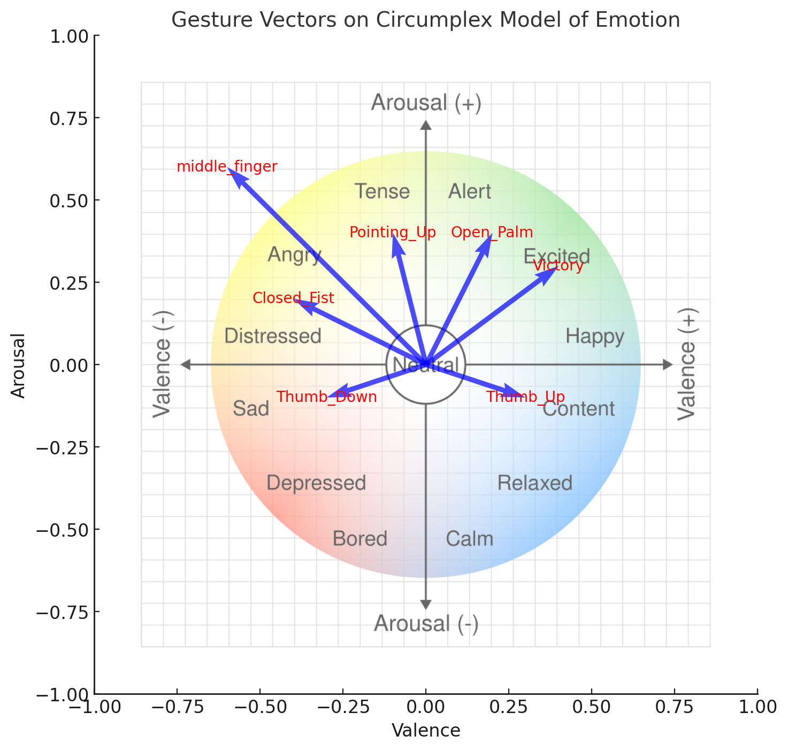

# maoarm

**Was wollt ihr denn?**  
  
Controlling the movement of the robotic arm RoArm-M2-S. In a cat-like way (whatever that is, we'll figure out).

## Basic usage

In 2 separate terminal windows, run the following scripts:

```sh
python3 -m arm.control
python3 -m cv
```

## Architecture overview
[Link to editable pic](https://excalidraw.com/#json=0Wufp0QSug0tEdAoG5rJ6,25YX3eRPnbc38rixEDPLcQ)


## Mood Impact of Gestures

