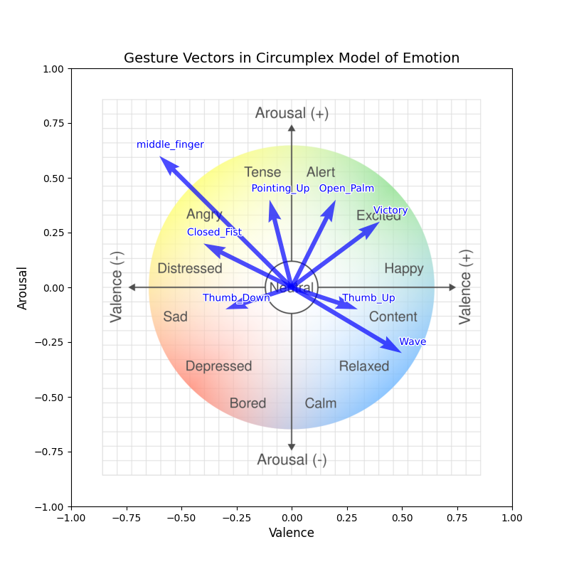

# maoarm

**Was wollt ihr denn?**  
  
This repo contains code for controlling the movement of the robotic arm RoArm-M2-S based on the obtained computer vision data. In a cat-like way (this includes nasty character and a 3D-printed cat head).

The idea of this project is to attach a camera to the robotic arm to detect faces and gestures, and use this information to update the movement mode of the arm. Originally, the arm only moved the camera in the direction of the detected face. Now, the project also supports different movement modes, based on the current mood of the cat character. Yes, there is an underlying character defining the movement style :)

**Current features**:
* Cross-platform compatibility
* PID movement control
* Face and gesture recognition
* Support of 2 face detection algorithms
* Recognition of 8 gestures (including wave and middle finger :sunglasses:)
* 4 movement modes (relaxed, excited, depressed, angry)
* Cat mood system to control movement modes:
    * Automatic random updates of the current mood based on Markov chain Monte Carlo (MCMC) approach
    * Mood updates are influenced by detected gestures

## Prerequisites
#### Hardware:
* RoArm-M2-S
* A camera or a web camera
* A computer (e.g. a laptop or a Raspberry Pi)

#### Software
* python3 (works best with 3.12) 

#### Download and configure
Clone repository, create venv and install dependencies:
```
python3 -m venv venv
source ./venv/bin/activate
pip install -r requirements.txt
```

## Basic usage

1. Assemble and turn on the robotic arm.
2. Connect to Wi-Fi `RoArm-M2` (password is 12345678).
3. Place a webcam somewhere near robotic arm's LED and connect it to the computer.

In 2 separate terminal windows, run the following scripts:

```sh
python3 -m arm.control
python3 -m cv
```

`python3 -m cv` supports different options for camera and face detection algorithm. Run `python3 -m cv --help` for details.

## Architecture overview
[Link to editable pic](https://excalidraw.com/#json=YMj9FkYP01Mxj0f9aDgZH,iCZbDP2nFBiHpHw-pKpiCQ)


## Mood Impact of Gestures

(script to update this image is provided in `.assets/GenerateMoodImpactOverview.py`)

## Repo structure
1. `arm` is a package for controlling the movement of the arm.
2. `cv` is a package for computer vision stuff for face and gesture detection.
3. `moods` is a package for simulating the mood and behaviour of the arm.

Regenerate: 
```
tree -I ".git|venv|.gitignore|__pycache__|face_detection_julian" --dirsfirst --noreport -L 2
```

```py
├── arm
│   ├── scripts/         # simple scripts to test arm's functionality, not project-related
│   ├── ArmControl.py    # wrapper around HTTP commands to the arm
│   ├── README.md
│   ├── __init__.py
│   ├── control.py       # main script doing all the job
│   └── pid.py           # PID control of arm movement speed
├── cv
│   ├── camera/          # classes representing different camera types
│   ├── detection/       # classes representing different detection algorithms
│   ├── models           # weights for implemented detection models
│   ├── README.md
│   ├── __init__.py
│   ├── __main__.py      # main script doing all the job
│   └── face.py          # data structure to abstract internal face representation
├── moods
│   ├── cat_characters/  # json files specifying gaussians for cat characters
│   ├── README.md
│   ├── __init__.py
│   ├── cat.py           # MCMC cat mood updates + visualization
│   └── simulate.py      # misc script to test simulation behaviour
├── README.md
└── requirements.txt
```

## Open issues and proposed features

1. **Camera connectivity issues**. The project works well with simple webcams. Using more complex webcams or even specific platforms (e.g. a MacBook instead of a Windows laptop with WSL2) causes the python module `arm.control` to lose connection to the arm. The underlying reason for this remains unknown despite extensive testing.
    > **Experimenting**: `arm.ArmControl` automatically keeps track of stats of HTTP requests to the arm. After running some code, you could visualize the stats by running `from arm.ArmControl import visualize; visualize()` in python REPL.
2. Making use of [realsense SDK](https://github.com/jannpf/maoarm/pull/11) features. The project supports a cooler camera with a lot of additional functions and features, like depth detection. Unfortunately, the `realsense` python package only properly works on Linux/WSL2, as of this writing.
3. Making PID more reliable by tuning the parameters with a 3D-printed head attached to the arm.
    > **Experimenting**: set `record_visualization: bool = True` in `arm.pid` PID class. Run some actual face detection, this will write data to a file. You can then visualize the obtained data by running `from arm.pid import visualize; visualize()` in python REPL.
4. Remembering faces and changing moods in accordance with this memory (should take informed consent into account).
5. More gestures, more moods, more cat profiles.
6. Getting the code to run with decent performance on Raspberry Pi.
